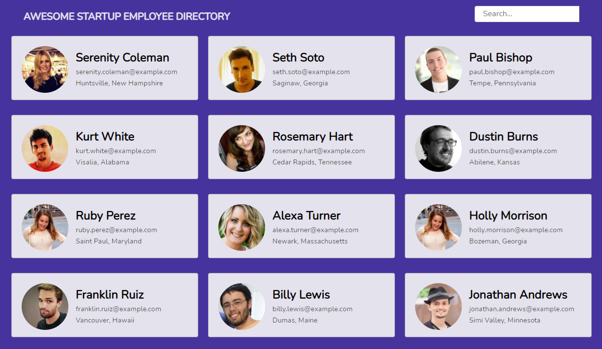
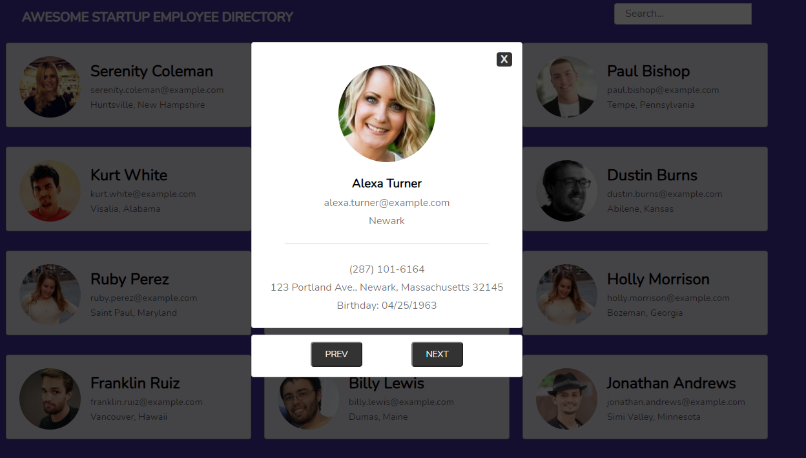

# Public API Employee Directory
A JavaScript site that asynchronously fetches fictitious user data from [randomuser.me](http://randomuser.me), a public API, and displays it.

A live demo can be found [here](https://jimjitsuesq.github.io/portfolio-employee-directory/).

## Table of Contents

* [General Info](#general-information)
* [Technologies Used](#technologies-used)
* [Features](#features)
* [Screenshots](#screenshots)
* [Contact](#contact)

## General Information
- This was the fifth project in my Team Treehouse Full-Stack JavaScript Tech Degree.
- I received a grade of "Exceeds Expectations" (the highest available).
- The main focuses of this project including fetching data from an API and writing asynchronous functions using async/await.
- Other emphases of this project were on creating modals and implementing real-time search functionality.

## Technologies Used
- JavaScript
- HTML
- CSS

## Features
- Search function
- Modals

## Screenshots

## Contact
Created by [@jimjitsuesq](https://www.jimpeters.dev/).  Feel free to contact me!
